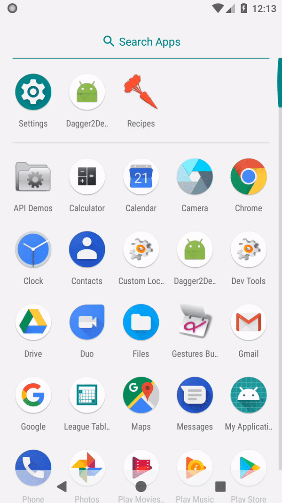

# Google Dagger 2 (Demo)

[](https://travis-ci.org/WeRockStar/Dagger2) [](https://codecov.io/gh/WeRockStar/Dagger2)

### Production code drive by Testing :) 

### Fully static, compile-time dependency injection framework for both Java and Android.
#### Configuration

###### build.gradle application module level

``` groovy
dependencies {
    ...
    implementation 'com.google.dagger:dagger:2.9'
    kapt 'com.google.dagger:dagger-compiler:2.9'
}
```

### You can use libraries or tools.
- RxJava2, RxAndroid2 
- Retrofit, OkHttp, OkHttp logging 
- Gson
- Dagger 2 

#### Testing framework 
- Junit 
- Mockito
- Jacoco (Test coverage)
- Espresso (UI Testing from `Google`)

#### CI Tools
- Circle CI 
- Travis CI

### Run UI-Test (Espresso)
```shell
./gradlew connectAndroidTest
```
<p align="left">
    
</p>